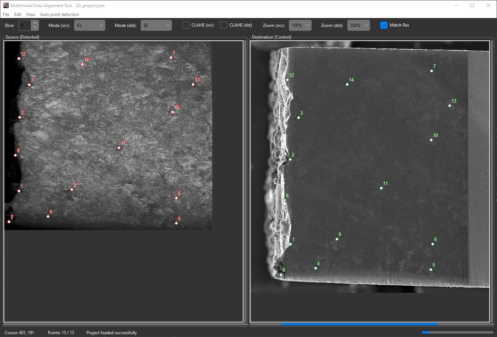
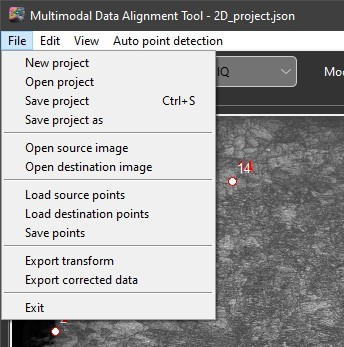
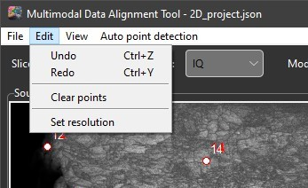
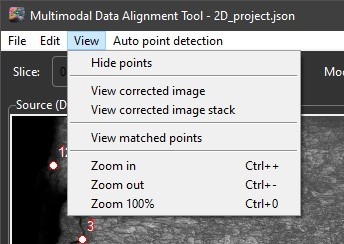
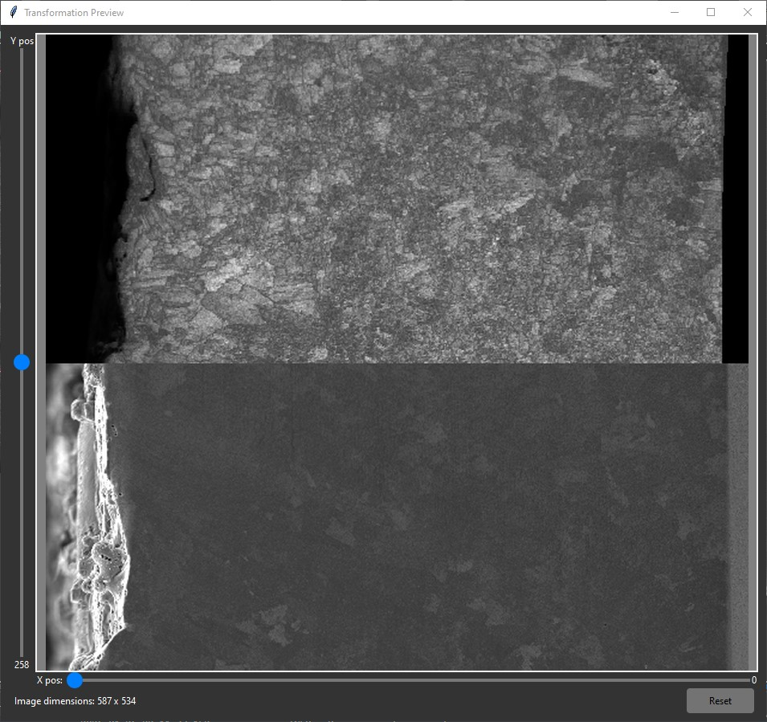
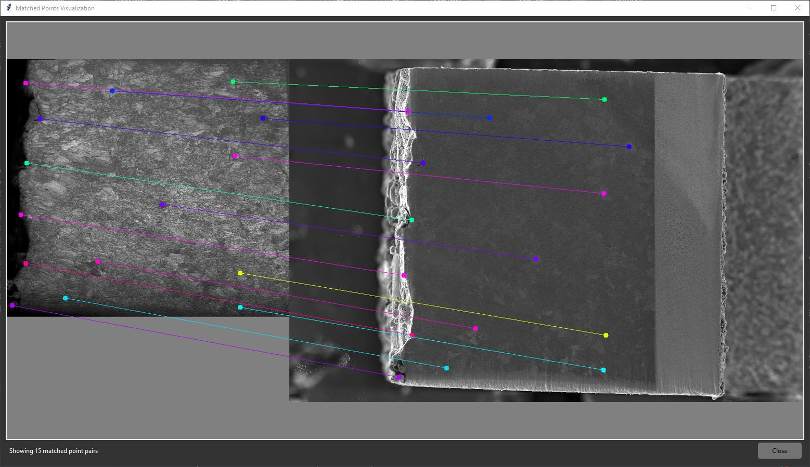
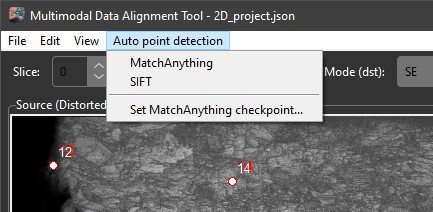
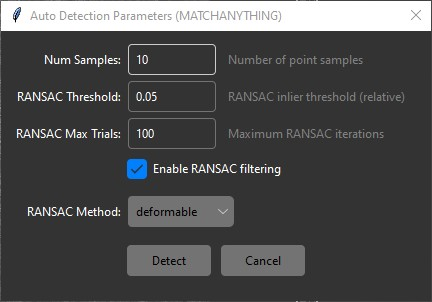

# Distortion correction for EBSD/BSE images

Contains python files for correcting distorted EBSD images using reference BSE images.

**Disclaimer: This codebase is under development. Although I try to update the README when changes are made, this does not always happen in a timely manner. Please post an issue if something is not working.**

## Usage

To download the code, either run `git clone git@github.com:lambjames18/EBSD-Correction.git` (assuming git is installed) or download the zip file of the repository and unpack it. Once it is downloaded, move into the directory (`cd EBSD-Correction`) and simply run `python GUI.py`. The conda environment used during development can be recreated using the `create_env.bat` file (Windows only). This will create a conda environment named "ebsd_correction" with all required packages installed. Note that the pytorch installation line may need to be modified depending on your system and whether or not you have a compatible NVIDIA GPU. See https://pytorch.org/get-started/locally/ for more information.

For information about miniconda (the lightweight command line version of anaconda) see https://docs.conda.io/en/latest/miniconda.html. The environment (named "align" in the command above) will need to be activated in order to run the code. Alternatively, any python interpreter can be used as long as the following packages are installed on your computer:

- `python >= 3.10`
- `numpy`
- `matplotlib`
- `h5py`
- `imageio`
- `scipy`
- `scikit-learn`
- `scikit-image`
- `tifffile`
- `pytorch` (for automatic distortion correction)
- `torchvision` (for automatic distortion correction)
- `kornia` (for automatic distortion correction)

---

## Description of GUI

### Landing Page

The landing page is shown below. The left and right panels show the source and destination images, respectively. The top bar contains controls that allow one to change the slice (if 3D data is loaded), change the modality shown in the viewers (if multimodal data is loaded), perform contrast local adaptive histogram equalization (CLAHE) on the images, zoom in and out, and perform resolution matching between the source and destination images. The bottom bar contains a status message and a progress bar that is shown when loading/saving projects or running automatic distortion correction. The viewers is where points can be added (left click) or removed (right click).

---

### Menubar

The file menubar contains options for creating/opening/saving projects, importing/exporting data, and importing exporting control points.

---

The edit menu contains options for undoing and redoing actions, clearning points in the project, and setting the resolution of the data. When setting the resolution, the user should specify the pixel size of the data in microns for both the source and destination images. The resolution is only used if the "Match Resolutions" option is enabled in the automatic correction settings. If this option is enabled, the control points will be automatically adjusted to account for differences in resolution between the source and destination images. If the resolution is not set, the code will assume that the source and destination images have the same resolution.

---

The view menu contains options for toggling the visibility of various elements in the GUI (e.g. control points). "Hide points" is self explanatory and simply removes the points from being visible in the viewers. The "View corrected image" and "View correced image stack" options will open a new window showing the corrected source image overlaid on the destination image. In the preview, there are sliders that allow you to adjust the overlay, and in the 3D case, change the slice and the slicing axis through the volume. This window is shown below. Only thin-plate spline transformations (affine only or fully deformable) are supported in this GUI.

The "View matched points" option of the view menubar will also open a new window showing the source and destination images side by side with lines connecting the matched control points. This window is shown below.

---

The auto menu contains options for running automatic distortion correction using a pretrained deep learning model. Using either SIFT or the pretrained MatchAnything model from HuggingFace, the code will attempt to find matched control points between the source and destination images. Note that if running the MatchAnything model, one will have to select the "Set MatchAnything checkpoint..." option from the menubar and direct the GUI to the location of the weights. Those weights can be downloaded [here](https://drive.google.com/file/d/12L3g9-w8rR9K2L4rYaGaDJ7NqX1D713d/view). The MatchAnything model is quite large and may take a while to load and run, especially if you do not have a compatible NVIDIA GPU. Running the model for the first time will download some internal model weights and may take a while to run. After the first run, the model will be cached and should run much faster.

If using MatchAnything, a few settings can be adjusted in the subsequent window that pops up (below). The default settings provide a good starting point for most cases, but feel free to experiment with the settings to see if you can get better results. "Num samples" refers to the maximum number of matched points that the model will return. "RANSAC Threshold" is used to select valid points and should be in the range 0.01-0.1 for most images. "RANSAC Max Trials" is the maximum number of iterations that RANSAC will run to find valid points and should be at least 100. "Enable RANSAC filtering" should almost always be True and will filter the matched points using RANSAC to find a subset of valid points that are consistent with a global transformation. This can help to improve the quality of the matched points, especially if there are a lot of outliers. "RANSAC Method" is the type of transformation that RANSAC will use to find valid points and should generally be set to "deformable" for this application (a thin-plate spline transformation is a deformable transformation).

---

## Tutorial

### Load data
Load source and destination images using the "Open source image..." and "Open destination image..." options in the file menubar. The source image is the one that will be warped to match the destination image, so typically the more distorted image should be loaded as the source and the less distorted image should be loaded as the destination. Images and EBSD data (ang files or 2D, dream3d files for 3D) can be loaded. For any basic image type, the user will be prompted to name the modality of the data (e.q. BSE, TLD, SE, etc.). Additional modalities can be added by selecting the "Open [...] image..." additional times and entering different modality names. For EBSD data, all available modalities will be loaded automatically. Make sure to set the resolution of the data after loading using the "Set resolution..." option in the edit menubar. From here, it is recommended to save the project using the "Save project..." option in the file menubar. This will save all loaded data, control points, and settings in a single json file that can be easily reloaded later.

### Select control points
With the images loaded, the user can add control points by left clicking in the viewers. Points can be removed by right clicking near a point. The control points should be placed in corresponding locations in the source and destination images. It is recommended to place points in areas that are easily identifiable in both images and are distributed evenly across the field of view.

Tips include using CLAHE to enhance contrast in the images, zooming in to place points more accurately, and using the "Match resolutions" option so that features in the source and destination images are the same size. This will make it easier to place points in corresponding locations in the two images. Generally speaking, points should be well distributed across the field of view and there should be at least 10-20 points for a good correction, although this number may vary depending on the amount of distortion in the images and the desired level of accuracy.

### Preview correction and revise points as needed
With the control points selected, the user can preview the correction by selecting the "View corrected image" option in the view menubar. If the correction does not look good, try adjusting the control points and previewing again until you are satisfied with the result.

### Export corrected data
Once the user is satisfied with the correction, the corrected source image can be exported using the "Export corrected data..." option in the file menubar. You will be prompted to select an export format (note that an ANG file can only be exported if the source data was originally loaded from an ANG file). After selecting the export format, you will be prompted to select an export location. The GUI will save out the corrected source image, the original source image, and the destination image. **Note: You will have to select a cropping (source or destination) for the output. Source means that the output will have the same image dimensions as the source image. Destination means that the output will have the same as the destination. In most cases, destination will be preferred. However, for EBSD data, particularly dream3d files, one should select source so that the EBSD grid can be preserved.** The cropping selection is also required for the preview. If using the source cropping mode, the resolution should be set to ensure that features in the source and destination images are the same size.