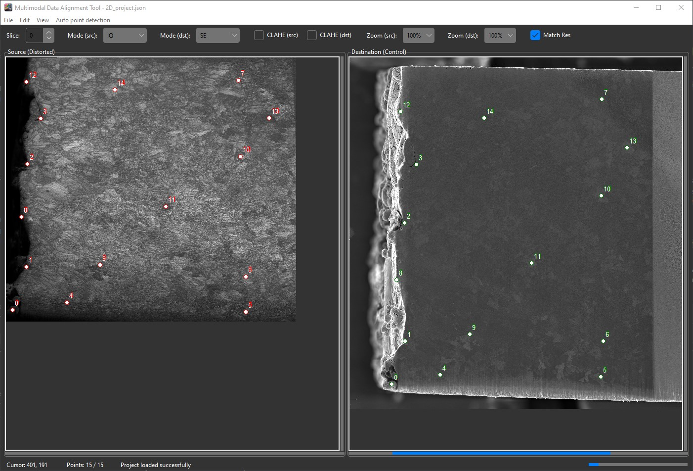

# Multimodal Image Registration GUI

[](https://github.com/lambjames18/tps-image-registration-gui/actions/workflows/ci.yml)
[](https://github.com/lambjames18/tps-image-registration-gui/actions/workflows/ci.yml)
[](https://github.com/lambjames18/tps-image-registration-gui/actions/workflows/ci.yml)
[](https://www.python.org/downloads/)
[](LICENSE)

A desktop application for aligning multimodal microscopy data using a thin-plate
spline transformation fitted to matched control points. Built for correlating
EBSD maps with SEM imaging, but it works on any pair of images that share
features, in 2D or across a serial-sectioning stack.



- Place control points by hand, or detect them automatically with SIFT or a
  pretrained deep-learning matcher.
- Fit quality is shown live as you click: each point carries its leave-one-out
  residual, so a bad correspondence is visible while you are still looking at
  it.
- Reads EBSD formats (`.ang`, `.h5`, `.dream3d`) alongside ordinary images, and
  exports back to them.
- Handles large images — a stitched optical mosaic is bounded by the tile size
  rather than by the image.
- Registers a whole serial-section stack from the command line, no GUI needed.

## Documentation

| | |
|---|---|
| [User guide](docs/user-guide.md) | The application, menu by menu — points, previews, quality metrics, smoothing, export. |
| [Stack registration](docs/stack-registration.md) | The command-line script for aligning a folder of serial sections. |
| [Library API](docs/api.md) | Using `tpsreg` from a script or notebook, without a display. |
| [Changelog](CHANGELOG.md) | What changed, and why. |

---

## Installation

Requires Python 3.11 or newer. This project is distributed through GitHub
rather than PyPI, so install it from a release or directly from the repository.

**From the latest release** — download the `.whl` from the
[releases page](https://github.com/lambjames18/tps-image-registration-gui/releases),
then:

```bash
pip install tpsreg-*-py3-none-any.whl
```

**From the repository:**

```bash
pip install git+https://github.com/lambjames18/tps-image-registration-gui.git
```

Either way, launch it with:

```bash
tpsreg
```

Installing into a virtual environment is a good idea if you use Python for
other work:

```bash
python -m venv tpsreg-env
source tpsreg-env/bin/activate     # Windows: tpsreg-env\Scripts\activate
pip install <wheel-or-git-url>
tpsreg
```

### Tk

The interface uses Tkinter, which ships with Python on Windows and macOS but is
a separate package on most Linux distributions:

```bash
sudo apt install python3-tk        # Debian, Ubuntu
sudo dnf install python3-tkinter   # Fedora, RHEL
sudo pacman -S tk                  # Arch
```

### Optional extras

The base install is deliberately lightweight — it does not pull in PyTorch.
Everything except automatic point detection works without it: loading data,
placing control points, CLAHE, previewing, and every export path.

| Extra | Install | What it adds |
|---|---|---|
| `accelerated` | `pip install "tpsreg[accelerated]"` | GPU-accelerated CLAHE and resizing via kornia/torchvision. Falls back to scikit-image without it. |
| `matchanything` | `pip install "tpsreg[matchanything]"` | Automatic control point detection with the pretrained MatchAnything/ROMA model. |

To use MatchAnything you also need the model weights, which are
[downloaded separately](https://drive.google.com/file/d/12L3g9-w8rR9K2L4rYaGaDJ7NqX1D713d/view)
and pointed at from **Points → Set MatchAnything checkpoint...**. The model runs on
CUDA, Apple Silicon (MPS) or CPU, selected automatically. The first run downloads
additional internal weights.

Only CUDA gets the model's half-precision fast path: it depends on CUDA
autocast, and parts of the model stay in full precision without it. On MPS and
CPU the model therefore runs entirely in float32, which is correct but
appreciably slower and uses more memory. A machine with an NVIDIA GPU is worth
using if you have one.

### Development install

```bash
git clone https://github.com/lambjames18/tps-image-registration-gui.git
cd tps-image-registration-gui
pip install -e ".[dev]"
pre-commit install
pytest
```

Or with [uv](https://docs.astral.sh/uv/):

```bash
uv sync --all-extras
uv run tpsreg
```

---

## Quickstart

The `demo_data/` directory contains a complete 2D example (an EBSD scan, BSE and
SE micrographs, and pre-picked control points) and a 3D serial-sectioning
example — the fastest way to see a working result. See
[demo_data/README.md](demo_data/README.md) for what is in them.

1. **Load your images.** File → *Open source image...* and *Open destination
   image...*. The **source** is the image that gets warped, so load the more
   distorted one there. Plain images (`.tif`, `.png`, `.jpg`) prompt for a
   modality name; EBSD files (`.ang`, `.h5`, `.dream3d`) load all their
   modalities automatically.
2. **Set the resolution.** Edit → *Set resolution...*, in microns per pixel for
   both images. Needed for the "Match resolutions" feature and for
   source-cropped export.
3. **Save the project.** File → *Save project...* writes all data, points and
   settings to a single JSON file.
4. **Place control points.** Left-click to add, right-click near a point to
   remove, and drag a point to adjust it. Click the source first, then its
   partner in the destination.
5. **Preview.** View → *Corrected image*. Adjust points and repeat until
   satisfied.
6. **Export.** File → *Export corrected data...*.

Aim for 10–20 points spread evenly across the field of view; more distortion
needs more points. CLAHE and zoom make features easier to match precisely,
"Match resolutions" renders both images at the same feature scale, and
"Link views" keeps the two panels at the same zoom and scroll position.

From here, the [user guide](docs/user-guide.md) covers the rest of the
interface.

---

## Troubleshooting

**`tpsreg: command not found`** — the install went into a different environment
than the one on your `PATH`. Activate the environment you installed into, or
run it as `python -m tpsreg`.

**`ModuleNotFoundError: No module named 'tkinter'`** — Tk is a separate system
package on Linux; see [Tk](#tk) above. On macOS it is missing from some
Homebrew Python builds, which `brew install python-tk` fixes.

**The Points menu's MatchAnything option does nothing, or reports a missing
checkpoint** — the model weights are a separate download and have to be pointed
at from **Points → Set MatchAnything checkpoint...**; see
[optional extras](#optional-extras).

**Automatic point detection is very slow** — on Apple Silicon and CPU the model
runs entirely in float32, because its half-precision path depends on CUDA
autocast. This is expected. SIFT is much faster if you only need a rough
starting point.

**The fit is refused before it runs** — control points are checked first, and
too few points, coincident points, or points all on one line are reported by
name rather than surfacing as a solver error later. Spread the points out.

**The warped result looks contorted around a few points** — the spline passes
exactly through every point, including your click errors. Turn on
[smoothing](docs/user-guide.md#smoothing), or find the bad correspondence with
View → *Check registration quality*.

If none of that helps, please
[open an issue](https://github.com/lambjames18/tps-image-registration-gui/issues).

---

## Citing

If you use this software in published work, please cite it. GitHub's *Cite this
repository* button generates a formatted citation from
[CITATION.cff](CITATION.cff).

---

## Contributing

Bug reports and pull requests are welcome — see [CONTRIBUTING.md](CONTRIBUTING.md).

## License

MIT — see [LICENSE](LICENSE).

This project vendors the [MatchAnything](https://github.com/zju3dv/MatchAnything)
model and its RoMa dependency under `src/tpsreg/Matchanything/`, which carry
their own permissive licenses (Apache-2.0 and MIT). See [NOTICE.md](NOTICE.md).
