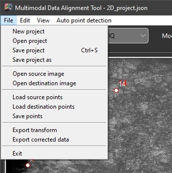
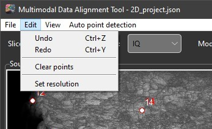
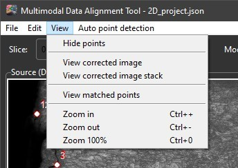
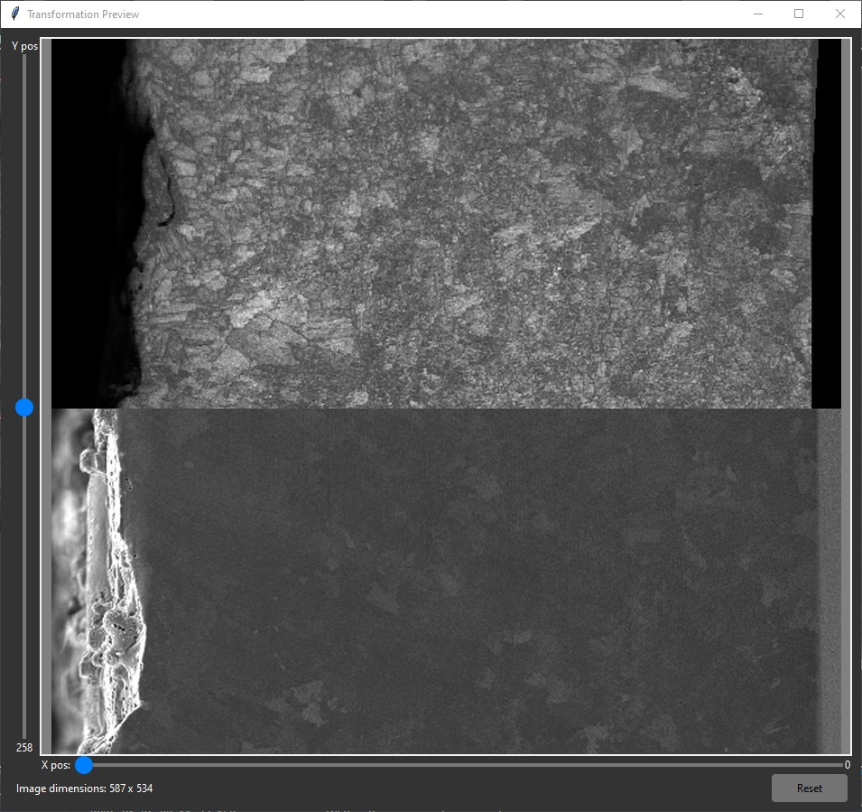
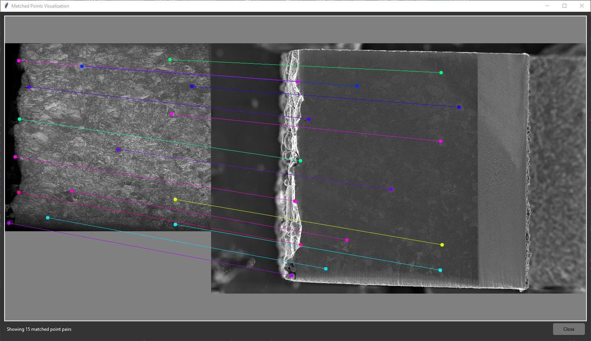
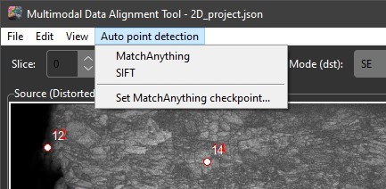
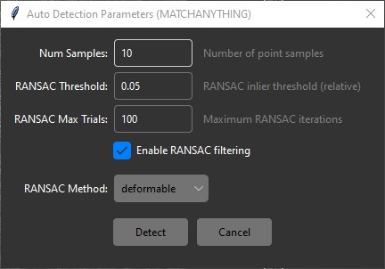

# Multimodal Image Registration GUI

[](https://github.com/lambjames18/tps-image-registration-gui/actions/workflows/ci.yml)
[](https://github.com/lambjames18/tps-image-registration-gui/actions/workflows/ci.yml)
[](https://github.com/lambjames18/tps-image-registration-gui/actions/workflows/ci.yml)
[](https://www.python.org/downloads/)
[](LICENSE)

A desktop application for aligning multimodal microscopy data using a thin-plate
spline transformation fitted to matched control points. Built for correlating
EBSD maps with SEM imaging, but it works on any pair of images that share
features, in 2D or across a serial-sectioning stack.


---

## Installation

Requires Python 3.11 or newer. This project is distributed through GitHub
rather than PyPI, so install it from a release or directly from the repository.

**From the latest release** (recommended — download the `.whl` from the
[releases page](https://github.com/lambjames18/tps-image-registration-gui/releases)):

```bash
pip install tpsreg-0.2.0-py3-none-any.whl
```

**From the repository:**

```bash
pip install git+https://github.com/lambjames18/tps-image-registration-gui.git
```

Either way, launch it with:

```bash
tpsreg
```

Installing into a virtual environment is a good idea if you use Python for
other work:

```bash
python -m venv tpsreg-env
source tpsreg-env/bin/activate     # Windows: tpsreg-env\Scripts\activate
pip install <wheel-or-git-url>
tpsreg
```

### Tk

The interface uses Tkinter, which ships with Python on Windows and macOS but is
a separate package on most Linux distributions:

```bash
sudo apt install python3-tk        # Debian, Ubuntu
sudo dnf install python3-tkinter   # Fedora, RHEL
sudo pacman -S tk                  # Arch
```

### Optional extras

The base install is deliberately lightweight — it does not pull in PyTorch.
Everything except automatic point detection works without it: loading data,
placing control points, CLAHE, previewing, and every export path.

| Extra | Install | What it adds |
|---|---|---|
| `accelerated` | `pip install "tpsreg[accelerated]"` | GPU-accelerated CLAHE and resizing via kornia/torchvision. Falls back to scikit-image without it. |
| `matchanything` | `pip install "tpsreg[matchanything]"` | Automatic control point detection with the pretrained MatchAnything/ROMA model. |

To use MatchAnything you also need the model weights, which are
[downloaded separately](https://drive.google.com/file/d/12L3g9-w8rR9K2L4rYaGaDJ7NqX1D713d/view)
and pointed at from **Auto → Set MatchAnything checkpoint...**. The model runs on
CUDA, Apple Silicon (MPS) or CPU, selected automatically. The first run downloads
additional internal weights.

Only CUDA gets the model's half-precision fast path: it depends on CUDA
autocast, and parts of the model stay in full precision without it. On MPS and
CPU the model therefore runs entirely in float32, which is correct but
appreciably slower and uses more memory. A machine with an NVIDIA GPU is worth
using if you have one.

### Development install

```bash
git clone https://github.com/lambjames18/tps-image-registration-gui.git
cd tps-image-registration-gui
pip install -e ".[dev]"
pre-commit install
pytest
```

Or with [uv](https://docs.astral.sh/uv/):

```bash
uv sync
uv run tpsreg
```

---

## Quickstart

The `demo_data/` directory contains a complete 2D example (an EBSD scan, BSE and
SE micrographs, and pre-picked control points) and a 3D serial-sectioning
example. See [demo_data/README.md](demo_data/README.md) for details.

1. **Load your images.** File → *Open source image...* and *Open destination
   image...*. The **source** is the image that gets warped, so load the more
   distorted one there. Plain images (`.tif`, `.png`, `.jpg`) prompt for a
   modality name; EBSD files (`.ang`, `.h5`, `.dream3d`) load all their
   modalities automatically. Call *Open ... image* again with a different name
   to add more modalities on the same grid.
2. **Set the resolution.** Edit → *Set resolution...*, in microns per pixel for
   both images. Needed for the "Match resolutions" feature and for source-cropped
   export.
3. **Save the project.** File → *Save project...* writes all data, points and
   settings to a single JSON file.
4. **Place control points.** Left-click to add, right-click near a point to
   remove, and drag a point to adjust it. Click the source first, then its
   partner in the destination.
5. **Preview.** View → *View corrected image*. Adjust points and repeat until
   satisfied.
6. **Export.** File → *Export corrected data...*.

Aim for 10–20 points spread evenly across the field of view; more distortion
needs more points. CLAHE and zoom make features easier to match precisely,
"Match resolutions" renders both images at the same feature scale, and
"Link views" keeps the two panels at the same zoom and scroll position.

Before estimating a transform, the control points are checked and anything
that will make the fit fail — too few points, points on top of each other,
points all on one line — is reported with the problem named, rather than
surfacing as a solver error a few seconds later. Points that will merely give
a poor result, such as a cluster in one corner of the image, produce a warning
you can dismiss.

---

## Interface reference

### Main window

The left and right panels show the source and destination images. The top bar
controls the slice (for 3D data), the displayed modality, CLAHE, zoom, view
linking, resolution matching, and smoothing. The bottom bar shows the cursor
position, the point count, the live fit quality, a status message, and a busy
indicator during long operations.

Left-click places a control point. Right-clicking near one removes the pair.
Dragging a point moves it, which is the quick way to correct a click that
landed slightly off; the whole drag is a single undo step. **Link views** ties
the two panels together so zooming or scrolling one does the same to the other.

Once there are nine or more pairs, each marker shows its leave-one-out
residual and is coloured from green to orange by how large it is, and the
status bar shows the median and the worst point. These update as you place,
delete and drag points, so a bad correspondence is visible while you are still
looking at it. Below nine points nothing is shown — see the note under *Check
registration quality* for why.

### File menu



Create, open and save projects; import and export data; import and export
control points.

### Edit menu



Undo and redo, clear points, and set the pixel size of each image. Each click is
one undoable step, as is each drag. Undo and redo are greyed out when there is
nothing to undo or redo. If the resolution is not set, both images are assumed
to have the same pixel size.

### View menu



Toggle point visibility and open the preview windows.

*View corrected image* overlays the warped source on the destination, with
sliders for the blend and — in 3D — for the slice and slicing axis. The 2D
preview offers three ways to compare:

| Mode | Shows |
| --- | --- |
| `wipe` | Drag the sliders to sweep one image over the other. Best for checking a single edge. |
| `checkerboard` | Alternating squares from each image. Misalignment shows as features stepping sideways at every tile boundary. |
| `difference` | Absolute difference. A good alignment is black; whatever still glows did not line up. |



*Check registration quality* fits a transform and reports how good the
correspondences look. Worth knowing about what it does **not** do: it does not
report how far the fit lands from each control point, because a thin-plate
spline interpolates — it passes exactly through every point it was given, so
that number is around 1e-12 whether the points are good or badly wrong.

| Measure | What it tells you |
| --- | --- |
| Leave-one-out residual | Refits without each point and measures how far the fit misses it. This is where a mistyped correspondence shows up. Flagged points are drawn with a larger warning-coloured ring so you can find them. |
| Jacobian determinant | Goes negative where the mapping folds over itself, producing mirrored patches. Invisible to any per-point measure, since the points on either side of a fold are still matched exactly. |
| Bending energy | How far the warp is from a plain affine. Zero for a pure affine, growing as the deformation gets more local. |
| Coverage | Fraction of the image the points enclose. Everything outside is extrapolated. |

### Smoothing

Off by default. The top bar has a **Smoothing** selector with *Off*,
*Automatic*, and a manual number.

Exact interpolation is not the same as an accurate transform. The spline
passes through every control point you place, which means it also reproduces
every click error exactly — it contorts itself to honour your mistakes.
Smoothing lets the fit miss the points a little in exchange for a better match
to the real deformation.

*Automatic* picks the strength by leave-one-out cross-validation, which is
worth using in preference to the manual number: the strength has no units
anyone has an intuition for, and the right value depends on how noisy your
clicks are relative to the distortion you are correcting. On synthetic data
with a known answer and 1.5 px of click noise it roughly halved the error
against the true deformation. With clean points it selects zero and changes
nothing, so it costs you nothing to leave on.

The manual number is normalised, so the same value means roughly the same
thing whatever the image size. Useful values are typically between 0.001 and
1.

Leave-one-out needs roughly nine well-spread points to mean anything: it asks
the remaining points to predict the held-out one, and with only a handful that
question has no good answer for any of them. The check refits once per control
point, so it is on a menu rather than running as you click — about 15 ms at 50
points, 0.3 s at 200.

*View matched points* shows both images side by side with lines joining matched
points, which makes bad correspondences obvious.



### Auto menu



Detect control points automatically with either SIFT or the pretrained
MatchAnything model.



| Setting | Meaning |
|---|---|
| Num samples | Maximum number of matched points to return. |
| Enable RANSAC filtering | Reject correspondences inconsistent with a global transform. Leave on. |
| RANSAC method | `deformable` (default), `affine`, or `projective`. `deformable` and `projective` give broadly similar results; use `affine` only when you know the distortion is affine. |
| RANSAC threshold | 0.01–0.1 for `deformable` (normalized units), around 5.0 for `affine`/`projective` (pixels). |
| RANSAC max trials | Iterations. At least 100; raise it when the outlier rate is high. |

---

## Export formats and cropping

Exporting asks for a format and a cropping mode:

- **Destination cropping** produces output with the destination image's
  dimensions. Prefer this in most cases.
- **Source cropping** preserves the source grid. Use this for EBSD data,
  particularly DREAM.3D files, where the grid must be preserved. Set the
  resolution first so features end up at the same scale.

An `.ang` file can only be exported when the source data was loaded from one.

---

## Registering a stack of images

`scripts/register_stack.py` aligns a folder of images slice by slice using the
MatchAnything model, without the GUI and without a display. It is meant for
serial-section data — FIB/SEM slices, serial optical sections — where clicking
points on every pair is not realistic.

```bash
python scripts/register_stack.py \
    --input  path/to/slices \
    --output path/to/results \
    --transform rigid
```

Add `--dry-run` first on a large stack: it prints what would be processed, in
the order it would be processed, and stops before loading the model. Filenames
are sorted numerically, so `slice_10` lands after `slice_9` rather than after
`slice_1`.

**Transform** (`--transform`) is one of `translation`, `rigid`, `affine`, or
`tps`. Prefer the most constrained model the physical situation allows: a
constrained model needs fewer matches and cannot invent deformation that is not
there. A thin-plate spline will happily absorb a handful of bad matches into a
warp that looks plausible slice by slice and is wrong.

**Reference** (`--reference`) decides what each slice is registered against,
and the choice is a real trade-off:

- `previous` (default) matches adjacent slices, which look alike, so matching
  is easy. Each slice's transform is the composition of every one before it, so
  small per-pair errors accumulate into drift along the stack.
- `first` and `middle` register everything against one fixed slice. Nothing
  accumulates, but the matcher is asked to relate slices that may be far apart
  and no longer resemble each other.

Sequential mode composes coordinate mappings rather than resampling once per
link, so a slice at the end of the stack is interpolated exactly once no matter
how long the chain is.

The output folder holds the aligned images plus the debugging trail:

```
registered/     the aligned images
matches/        each pair's matches, drawn as lines between the two images
overlays/       each registered slice checkerboarded against its reference
transforms/     the fitted transform per slice, as .npy
report.json     every number the run produced
summary.csv     one row per slice, for scanning or plotting
register.log    the full log
```

Per pair the report records the match count, the median and maximum residual,
how far the slice moved, and any warnings — too few matches for the chosen
model, degenerate point geometry, a residual out of line with the rest.
Residuals are ordinary for the constrained models and leave-one-out for `tps`,
since a spline interpolates and its ordinary residuals are always near zero.
Slices whose displacement is unlike their neighbours' are flagged by a
median/MAD z-score. A pair that fails to match or fit gets the identity
transform and is recorded as failed rather than aborting the run, so one bad
slice does not cost you the whole stack.

The registration logic is in `tpsreg.stack_registration` and takes the matcher
as an argument, so it can be used with a different matcher — or tested without
one:

```python
from tpsreg.stack_registration import register_stack, apply_transforms

transforms, result = register_stack(images, match_fn, transform_type="rigid")
registered = apply_transforms(images, transforms)
print(result.summary())
```

---

## Using tpsreg as a library

The registration core is importable and does not require a display:

```python
import numpy as np
from tpsreg import ThinPlateSplineTransform, transform_image

src = np.array([[10, 10], [10, 90], [90, 10], [90, 90], [50, 50]], dtype=float)
dst = np.array([[12, 11], [11, 88], [91, 13], [89, 92], [51, 49]], dtype=float)

# Fit a spline. The cost is set by the control points, not the image, and
# size is only recorded so exports are self-describing.
tform = ThinPlateSplineTransform()
tform.estimate(src, dst, size=(100, 100))

# Map coordinates directly. Exact, including at fractional positions.
where_they_land = tform.map(dst)

# Or warp an image in one call.
warped = transform_image(image, src, dst, output_shape=(100, 100), order=1)
```

`tpsreg.ransac.ransac_filter` is available separately for rejecting outlier
correspondences.

### Large images

A fitted transform is its coefficients — under a kilobyte, whatever the size
of the image. Warping is done a tile at a time once the output is large
enough that one coordinate array for the whole thing would be the limiting
factor, so a stitched optical mosaic is bounded by the tile rather than by
the image.

If you are going to query most of a grid repeatedly, a dense displacement
field can be cached, at whatever resolution is worth the memory:

```python
tform.build_field(size=(20000, 20000), downsample=4)   # a sixteenth the memory
...
tform.clear_field()                                    # give it back
```

The field is a cache. Clearing it changes speed, not results, beyond the
interpolation error a coarse field introduces — which falls away
quadratically as the field gets finer, and at quarter resolution is a few
hundredths of a pixel for typical control point spacings.

---

## Contributing

Bug reports and pull requests are welcome — see [CONTRIBUTING.md](CONTRIBUTING.md).
If something does not work, please
[open an issue](https://github.com/lambjames18/tps-image-registration-gui/issues).

## License

MIT — see [LICENSE](LICENSE).

This project vendors the [MatchAnything](https://github.com/zju3dv/MatchAnything)
model and its RoMa dependency under `src/tpsreg/Matchanything/`, which carry
their own permissive licenses (Apache-2.0 and MIT). See [NOTICE.md](NOTICE.md).
